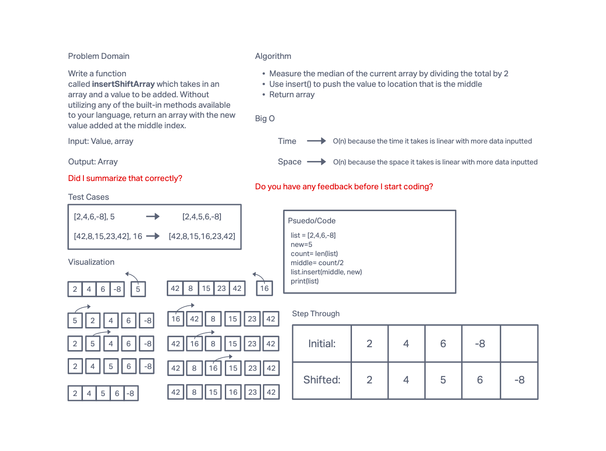

# Insert to Middle of an Array
Insert an element in the middle of the array without the use of any of Pythons built-in tools.

## Whiteboard Process

## Approach & Efficiency
I approached it in a relatively simple way. I count the amount of items in the array, divide that by two and place the new number in the index location and return the entire array. The Big O should be linear to O(n) so the time takes as long as there is many elements in the array.
