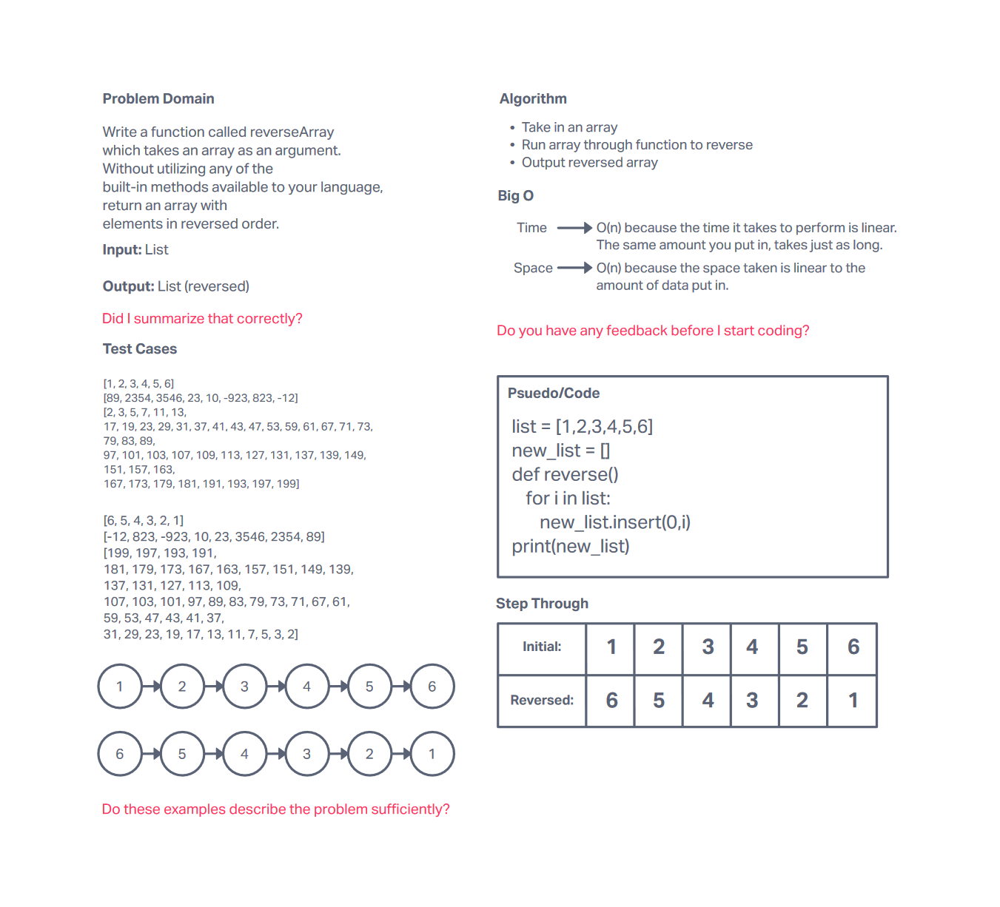

# Reverse an Array
Create a function that reverses the order of an array. Don't use the built in functions of Python to achieve this.

## Whiteboard Process

## Approach & Efficiency
<!-- What approach did you take? Discuss Why. What is the Big O space/time for this approach? -->
I took the approach of using insert() function. I think it is just easier to take in the array and pop each item into the area at the beginning so that the first number is last and last number is first. It just makes sense to have it work like this logically in my mind. The Big O should be O(n) for both time and space as it relies on the amount of items in the area and is linear.
